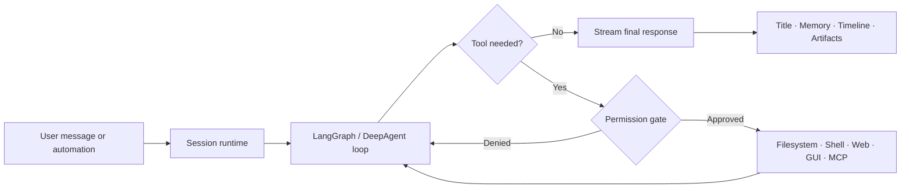
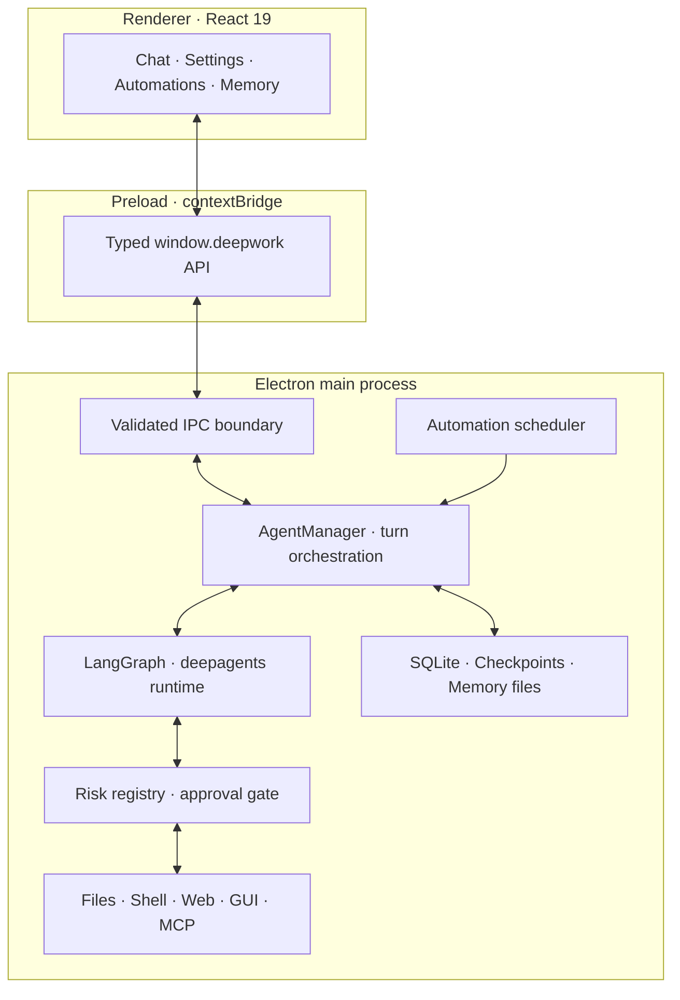

<div align="center">

# DeepWork

### Ship real work, not just chat.

**A local-first desktop AI agent for coding, automation, memory, and real computer work.**

[](#project-status)
[](https://www.electronjs.org/)
[](https://www.typescriptlang.org/)
[](#quick-start)
[](LICENSE)

[Why DeepWork?](#why-deepwork) · [Features](#features) · [Quick start](#quick-start) · [Architecture](#architecture) · [Security](#security-model) · [Contributing](#contributing)

</div>

---

DeepWork turns a conversation into an execution loop. Give it a workspace and it can inspect a codebase, plan a task, edit files, run commands, browse public documentation, operate desktop applications when no API exists, and keep useful context for the next session.

It runs as a native Electron application, keeps its operational state on your machine, works with cloud or local models, and puts consequential actions behind an explicit permission system.

> [!IMPORTANT]
> DeepWork is under active development. It can execute commands with your current operating-system user permissions. Review the [security model](#security-model) before using automatic execution modes or connecting it to sensitive workspaces.

## Why DeepWork?

Most AI chats end at an answer. DeepWork is built to continue from intent to outcome:

```text
Understand → Plan → Act → Observe → Recover → Remember
```

- **Local-first by design** — sessions, settings, checkpoints, memories, skills, and run history live on your computer.
- **Useful beyond coding** — work with files, the shell, the public web, MCP tools, and desktop applications from one task.
- **Bring your own model** — use Anthropic, OpenAI, Ollama, DeepSeek, Qwen, MiniMax, Kimi, OpenRouter, or a custom OpenAI-compatible endpoint.
- **Built for long-running work** — stream progress, inspect tool calls, cancel a turn, collect artifacts, and schedule repeatable automations.
- **Security-aware execution** — typed IPC, runtime validation, risk-ranked tools, explicit approvals, path boundaries, and SSRF defenses are part of the architecture.

## Features

| Capability | What it gives you |
| --- | --- |
| 🧠 **Persistent context** | Curated user memory, project memory, daily timeline memory, and searchable structured memories across sessions. |
| 🛠️ **Coding agent** | Read, search, create, and edit files; run shell commands; maintain task plans; and work inside a selected project. |
| 🖥️ **GUI fallback** | Capture the screen and use mouse/keyboard controls for workflows that do not expose an API. |
| 🌐 **Web tools** | Search the public web and fetch bounded page content with redirect-aware SSRF protection. |
| 🔌 **MCP + Skills** | Connect local or remote MCP servers and extend behavior with portable `SKILL.md` packages. |
| ⏰ **Automations** | Run once, daily, weekly, or cron-based tasks with timezones, validity windows, model selection, run history, and failure auto-pause. |
| 📎 **Multimodal chat** | Attach images, PDFs, and text files; preview images; and keep attachments visible in conversation history. |
| 📦 **Artifacts** | Keep generated deliverables isolated per session and open or reveal them directly from the app. |
| 💻 **Integrated terminal** | Inspect and control the active workspace without leaving the task. |
| 🔍 **Transparent execution** | See reasoning phases, tool activity, approvals, todos, turn state, timing, model, and token usage. |
| 🌍 **Cross-platform UI** | Electron + React desktop experience with light/dark themes and English/Chinese localization. |

## Quick start

### Prerequisites

- [Node.js](https://nodejs.org/) 22 or newer
- [pnpm](https://pnpm.io/)
- A supported model API key, or a local [Ollama](https://ollama.com/) instance

### Run from source

```bash
git clone https://github.com/hi-neason/DeepWork.git
cd DeepWork
pnpm install
pnpm dev
```

On first launch:

1. Open **Settings → Models**.
2. Select a provider, configure a model, and verify the connection.
3. Start a task and optionally select a project folder as its workspace.
4. Keep **Manual** permission mode enabled while learning how the agent uses tools.

API keys entered in the application are encrypted with Electron `safeStorage`. You can also provide credentials through environment variables:

| Provider | Environment variable | Notes |
| --- | --- | --- |
| Anthropic | `ANTHROPIC_API_KEY` | Also supports `ANTHROPIC_AUTH_TOKEN`, `ANTHROPIC_BASE_URL`, and `ANTHROPIC_MODEL`. |
| OpenAI | `OPENAI_API_KEY` | Used by OpenAI and as the fallback key for custom OpenAI-compatible endpoints. |
| DeepSeek | `DEEPSEEK_API_KEY` | Uses the configured DeepSeek-compatible endpoint. |
| Qwen | `DASHSCOPE_API_KEY` | Uses Alibaba DashScope's OpenAI-compatible API. |
| MiniMax | `MINIMAX_API_KEY` | Uses the configured MiniMax-compatible endpoint. |
| Kimi | `MOONSHOT_API_KEY` | Uses Moonshot's OpenAI-compatible API. |
| OpenRouter | `OPENROUTER_API_KEY` | Model identifiers can be entered directly. |
| Ollama | — | Defaults to `http://localhost:11434`; no API key is required. |

Custom base URLs and model identifiers can be configured from the UI. Local/private model endpoints are supported, while cloud metadata and link-local targets remain blocked.

### Desktop permissions

GUI control is optional. If you use it, your operating system may ask DeepWork for:

- screen-recording permission for screenshots;
- accessibility/input permission for mouse and keyboard control.

DeepWork requests approval before every GUI action, regardless of the selected permission mode.

## How it works

Every interactive chat and scheduled automation enters the same agent loop:



The main process owns model clients, agent state, tools, storage, MCP connections, approvals, and automations. The renderer only receives a deliberately limited API through Electron's preload bridge.

## Permission modes

DeepWork assigns every tool a risk level: `read`, `write`, `exec`, or `external`. Unknown tools fail closed at a high risk level.

| Mode | Behavior |
| --- | --- |
| **Plan** | Read-only planning. Mutating and GUI tools are blocked. |
| **Manual** | Ask before file writes, shell execution, external tools, and GUI control. This is the default and recommended mode. |
| **Auto Write** | Allow file writes; continue asking before shell, external, and GUI actions. |
| **Auto Execute** | Allow file writes and shell commands; continue asking before external and GUI actions. |

A legacy broad `auto` mode is retained only for compatibility with existing settings. GUI tools are never silently auto-approved.

> [!WARNING]
> The approval layer is a control mechanism, **not an operating-system sandbox**. Shell commands run with the same privileges as the current user. Automatic modes should only be used in trusted workspaces with models and MCP servers you trust.

## Automations

Turn a successful prompt into a recurring workflow without building a separate script:

- choose `once`, `daily`, `weekly`, or a cron expression;
- anchor schedules to an IANA timezone;
- select a workspace, model, permission mode, Skills, and MCP servers;
- constrain execution with optional start and end dates;
- inspect each run through its dedicated session history;
- automatically pause jobs after repeated failures.

The application must remain running, and the computer must be awake, for local automations to execute.

## Memory

DeepWork separates memory by purpose instead of treating all historical text as one endless chat:

| Memory layer | Purpose |
| --- | --- |
| **User memory** | Stable preferences, background, and curated personal context. |
| **Project memory** | Decisions, conventions, and facts scoped to a workspace. |
| **Timeline memory** | Daily summaries of completed work, discoveries, and open questions. |
| **Session history** | Original messages, reasoning phases, and tool execution checkpoints. |
| **Structured memory** | Searchable facts ranked through keyword and optional embedding retrieval. |

Automatic extraction is configurable. Semantic retrieval can use OpenAI embeddings, local Ollama embeddings, or be disabled.

## MCP and Skills

DeepWork has two complementary extension paths:

- **MCP servers** expose executable tools over local `stdio` or remote SSE/HTTP connections. MCP tools are treated as external-risk capabilities and pass through the approval system.
- **Skills** are local folders centered on a `SKILL.md` file, with optional scripts, references, and assets. They package reusable instructions and domain workflows without hard-coding them into the app.

MCP configuration itself requires approval before DeepWork starts a local command or connects to an endpoint.

## Architecture



### Process boundaries

```text
src/
├── main/
│   ├── agent/          # Runtime construction, turns, events, history, memory, titles
│   ├── automation/     # Scheduler and unattended task execution
│   ├── ipc/            # Validated renderer trust boundary
│   ├── mcp/            # MCP server lifecycle and tool discovery
│   ├── security/       # Approval gate
│   ├── storage/        # SQLite-backed settings, sessions, memory, and runs
│   ├── tools/          # Built-in tools, risk registry, and network guards
│   ├── skills/         # Local skill store
│   └── terminal/       # PTY lifecycle
├── preload/            # The only API exposed to the renderer
├── renderer/           # React UI and domain hooks/state
└── shared/             # Cross-process types, provider catalog, and i18n
```

### Local data layout

DeepWork keeps application-owned state under your home directory:

```text
~/DeepWork/
├── app/                # SQLite databases, checkpoints, and application state
├── memory/
│   ├── user/
│   ├── project_memory/
│   └── timeline_memory/
├── skills/             # Installed local Skills
└── workspace/          # Default isolated session workspaces
```

When you select a project folder, source operations are rooted in that project and generated deliverables are collected under `.deepwork/sessions/<session-id>/`.

## Security model

DeepWork treats the renderer, model output, tool arguments, URLs, paths, and extension metadata as untrusted input.

- **Validated IPC** — renderer arguments are parsed and bounded at the main-process boundary.
- **Least-privilege bridge** — the React renderer has no direct Node.js access and communicates only through `contextBridge`.
- **Risk-aware tools** — risk can be raised but never silently lowered; unknown tools default to high risk.
- **Scoped approvals** — approvals and cancellation belong to a session, preventing one task from authorizing or cancelling another.
- **Workspace boundaries** — external path input is checked and session artifacts are recomputed by the main process.
- **Network defenses** — public fetches block private, loopback, link-local, and metadata addresses and revalidate every redirect.
- **Secret handling** — stored API keys use Electron `safeStorage`; logs exclude credentials, authorization headers, prompts, and file contents.
- **Resource limits** — attachments, fetched pages, tool output, MCP discovery, approvals, and turns have bounds or timeouts.

Local-first does not mean no data ever leaves the machine. Prompts and selected context are sent to the model provider you configure. Web and MCP tools contact external services, and an approved screenshot sends visible screen content to the configured model. Always inspect the approval card and keep secrets out of visible windows.

If you discover a vulnerability, please avoid publishing exploit details in a public issue. Contact the maintainers privately through the repository owner's GitHub profile until a dedicated security contact is published.

## Development

| Command | Purpose |
| --- | --- |
| `pnpm dev` | Start Electron through electron-vite with hot reload. |
| `pnpm typecheck` | Check main/preload/shared and renderer TypeScript projects. |
| `pnpm test` | Run the Vitest unit and integration suite once. |
| `pnpm test:watch` | Run Vitest in watch mode. |
| `pnpm test:e2e` | Run Playwright end-to-end tests against a built app. |
| `pnpm build` | Type-check and create the Electron production build. |
| `pnpm package` | Build an unpacked application directory. |
| `pnpm dist` | Build platform installers with electron-builder. |

### Quality rules

Before opening a pull request:

```bash
pnpm typecheck
pnpm test
```

Changes to Electron IPC, storage, network access, paths, or tools should include regression coverage. Keep all user-facing strings synchronized between `en-US` and `zh-CN`, and never expose Node APIs directly to the renderer. See [`AGENTS.md`](AGENTS.md) for the complete engineering and security conventions.

## Technology

- **Desktop:** Electron, electron-vite, electron-builder
- **Frontend:** React 19, TypeScript, i18next, react-markdown
- **Agent runtime:** deepagents, LangChain.js, LangGraph
- **Models:** Anthropic, OpenAI-compatible providers, Ollama
- **Extensibility:** Model Context Protocol and `SKILL.md` packages
- **Persistence:** SQLite, better-sqlite3, LangGraph SQLite checkpointer
- **System integration:** node-pty, Electron desktop capture, nut.js
- **Testing:** Vitest, Testing Library, Playwright

## Contributing

Contributions that improve safety, reliability, model compatibility, accessibility, test coverage, or the extension ecosystem are especially welcome.

1. Fork the repository and branch from `dev`.
2. Keep each change focused and use a Conventional Commit message.
3. Add tests for behavior changes, especially at security boundaries.
4. Run `pnpm typecheck` and `pnpm test`.
5. Open a pull request against `dev` with the motivation, implementation notes, and verification steps.

Good places to contribute include sandboxed execution backends, richer tool observability, additional model/provider adapters, automation resilience, accessibility, and cross-platform packaging.

## Project status

DeepWork is an early-stage project under active development. Interfaces, storage structures, and extension APIs may change before the first stable release. Today, the best way to try it is to build from source and use a non-sensitive workspace while evaluating its behavior.

If the direction resonates with you, consider starring the repository, opening a focused issue, or contributing a small improvement. Every sharp edge reported makes the local agent loop safer and more useful.

## License

DeepWork is licensed under the [GNU Affero General Public License v3.0](LICENSE).

---

<div align="center">

**DeepWork — give your AI a workspace, tools, memory, and the responsibility to finish.**

[Back to top](#deepwork)

</div>
